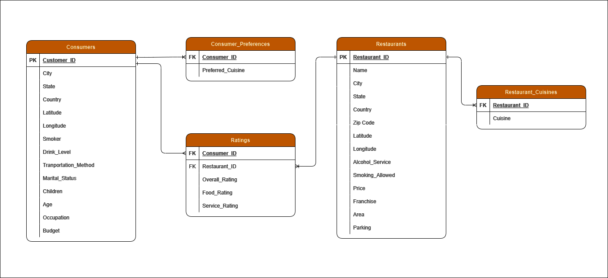
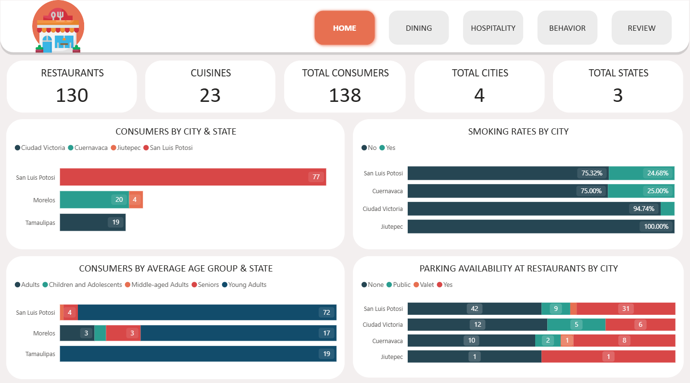
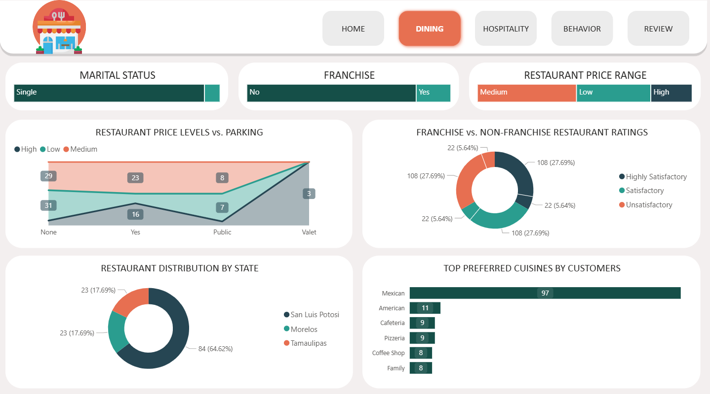
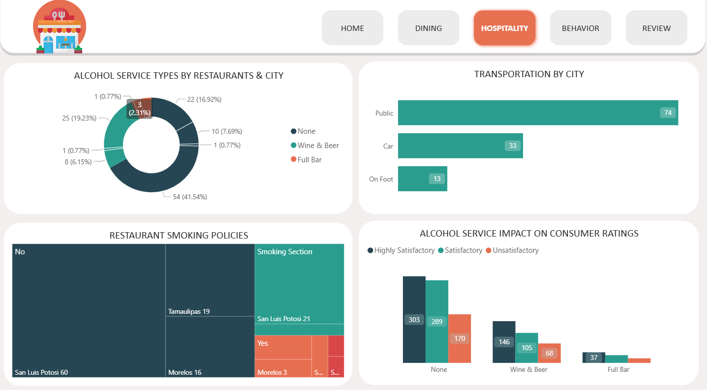
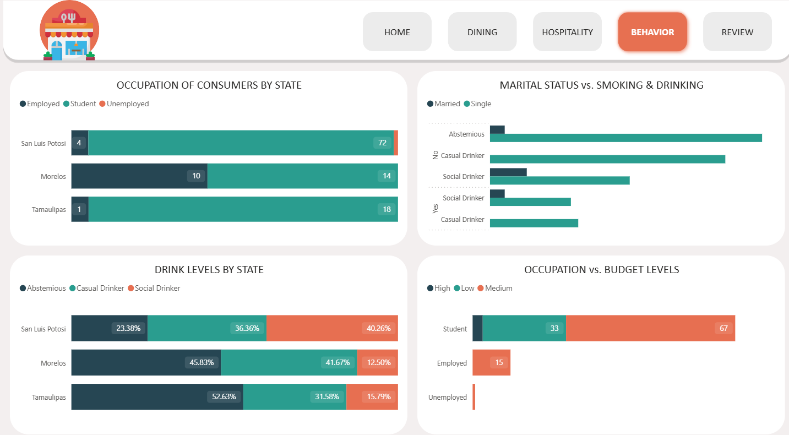
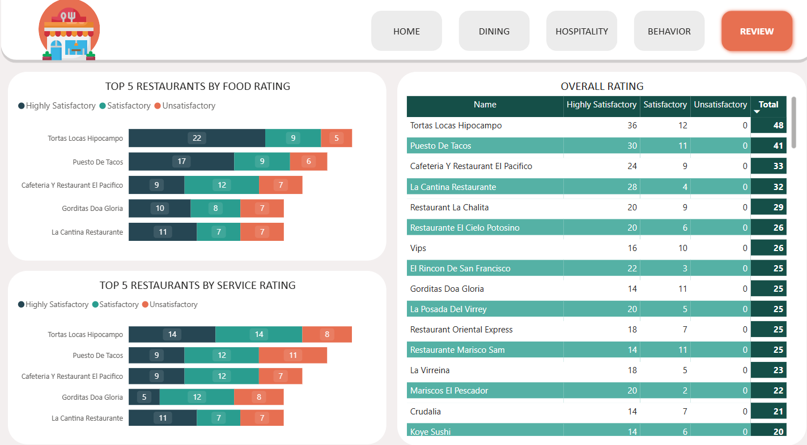

# 🍽️ Restaurant Ratings Analysis

Analyze real consumer restaurant ratings in Mexico (2012) to uncover insights about dining preferences, hospitality, and consumer behavior. This project uses Power BI for interactive dashboards and data exploration.

---

## 📑 Table of Contents

- [Project Overview](#project-overview)
- [Dataset Description](#dataset-description)
- [Entity Relationship Diagram](#entity-relationship-diagram)
- [Data Cleaning Steps](#data-cleaning-steps)
- [Key Insights](#key-insights)
- [Dashboard](#dashboard)
- [How to Use](#how-to-use)

---

## Project Overview

This project explores restaurant ratings in Mexico, combining consumer demographics, preferences, and restaurant attributes to answer business and hospitality questions. The analysis is supported by a Power BI dashboard.

---

## Dataset Description

The dataset includes:

- **Consumers**: Demographics, habits, and budgets.
- **Consumer Preferences**: Preferred cuisines.
- **Ratings**: Overall, food, and service ratings (0=Unsatisfactory, 1=Satisfactory, 2=Highly Satisfactory).
- **Restaurants**: Location, price, alcohol service, parking, franchise status, etc.
- **Restaurant Cuisines**: Types of food served.

See the [data dictionary](Dataset/data_dictionary.csv) for detailed field descriptions.

---

## Entity Relationship Diagram

<div align="center">
  
</div>

---

## Data Cleaning Steps

1. **Import Data**: Load all CSVs as a folder in Power BI.
2. **Transform Data**: Expand and clean each dataset.
3. **Create Calculated Fields**:
   - **AgeGroup**: Categorize consumers by age.
   - **Service/Food/Overall Rating Category**: Map numeric ratings to descriptive categories.

<details>
<summary>Sample DAX Calculated Field</summary>

```DAX
AgeGroup = 
SWITCH(
    TRUE(),
    consumers[Age] <= 18, "Children and Adolescents",
    consumers[Age] <= 30, "Young Adults",
    consumers[Age] <= 45, "Adults",
    consumers[Age] <= 60, "Middle-aged Adults",
    "Seniors"
)
```
</details>

---

## Key Insights

### Local Insights
- Most consumers are from San Luis Potosí.
- Young adults (<30) are the largest demographic.

### Dining Insights
- High-priced restaurants always offer parking; valet is exclusive to high price.
- San Luis Potosí has the most restaurants.

### Hospitality Insights
- 67% of restaurants do not serve alcohol.
- 61% of consumers use public transport.

### Behavior Insights
- Most students have a medium or low budget.
- Social drinking is most common in San Luis Potosí.

### Review Insights
- Top-rated restaurants: Tortas Locas Hipocampo, Puesto de Tacos, Cafeteria y Restaurante El Pacífico, Gorditas Doña Gloria, La Cantina Restaurante.

---

## Dashboard

Explore the interactive Power BI dashboard for visual insights:

<div align="center">
  
  
  
  
  
</div>

---

## How to Use

1. **Open Power BI** and load the `.pbix` file.
2. **Connect Data**: If needed, point to the `Dataset/` folder.
3. **Explore**: Use the dashboard to filter and analyze insights by city, state, price, and more.

---

## 📄 License

This project is licensed under the MIT License. See the [LICENSE](LICENSE) file for details.

<p align="left">
  
</p>

"# Restaurant-Ratings-Analysis" 
